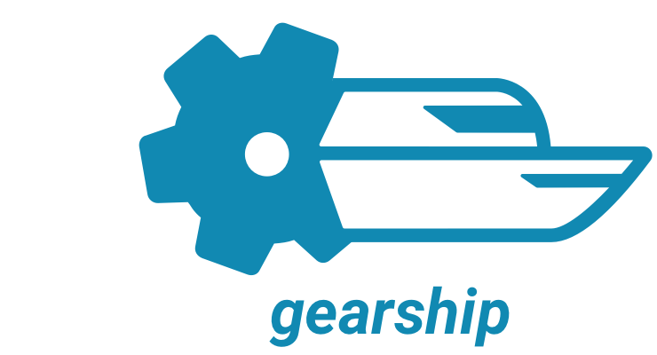
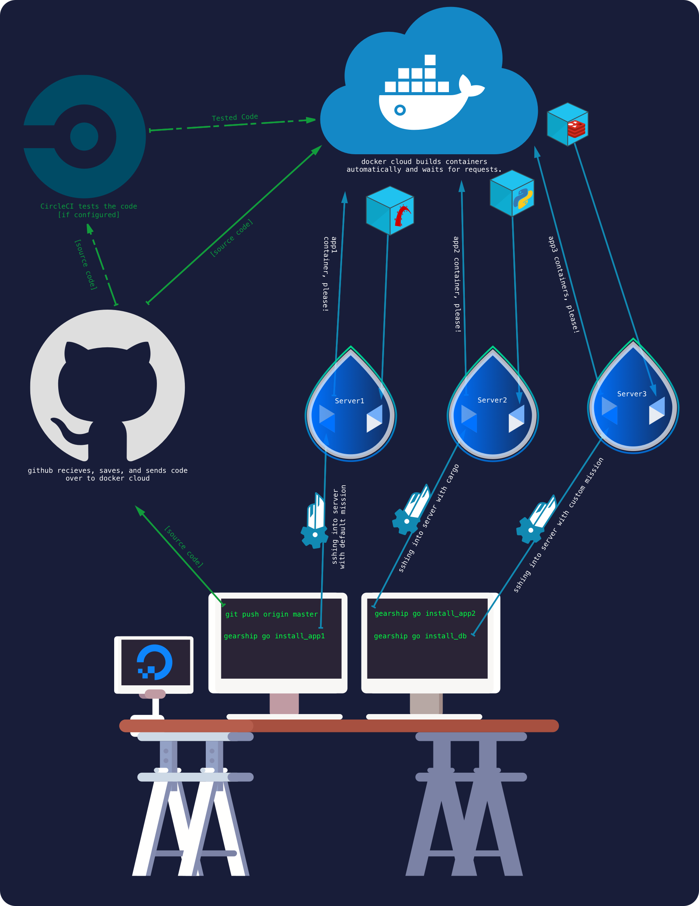

--------
## `gearship` deploys dockerized projects to virtual machines.

Created as a micro alternative to puppet, chef, capistrano, etc, for managing droplets on digital ocean.

### Overview
- `gem install gearship`
- `gearship init`
- update `gearship.yml` with server configuration
- update `gearship.sh` with install configuration
- `gearship go setup_host`
- `gearship go deploy_app`
- your app is live!

----------

## Quickstart

Install Gem:

```bash
$ gem install gearship
```

`cd` into your project directory then create the `gearship` folder:

```bash
$ cd my_project
$ gearship init
```

`cd` into the `gearship` folder and edit `gearship.yml` with your server configuration

Run `gearship go setup_host` to install docker on a new server:

```bash
$ cd gearship
$ gearship go setup_host
```

Ship your dockerized project to the docker host:

```bash
$ gearship go deploy_app
```
---------
## gearship performs missions which are composed of actions.

- Shell scripts under the `missions` directory, such as `setup_host.sh` or `deploy_app.sh`, are automatically recognized as a mission. 

- The actions folder has reusable actions that can be called from any `mission_name.sh` with `source actions/action_name.sh`.

- Actions can be retrieved remotely via HTTP. Put a URL in the actions section of `gearship.yml`, and gearship will automatically load the content and put it into the `compiled/actions` folder in the compile phase.
 
- `gearship go install_app` is  equivalent to running `gearship.sh`, followed by `install_app.sh`.

### What gearship does when `gearship go setup_app` is called

1. Compile `gearship.yml` to generate attributes, retrieve remote actions, and copy files from `cargo` into the `compiled` directory. Append `setup_app.sh` file to a copy of `gearship.sh` in the `compiled` directory.
2. SSH to the server specified in gearship.yml
3. Transfer the content of the `compiled` directory to the remote server and extract in `$HOME/gearship`
4. Run `gearship.sh` on the remote server.

## Commands

```bash
$ gearship                                        # Show command help
$ gearship init                                   # Install gearship into project
$ gearship go [mission]                           # go docker project
```


## Passing setup variables to scripts during compilation

#### Ruby
Attributes defined in `gearship.yml` are accessible from any file with `<%= @attributes.attribute_name %>` when `eval_erb: true` is set in `gearship.yml`

#### Bash
Attributes defined in `gearship.yml` are split into individual files in `compiled/attributes`. 
Refer to them by `$(cat attributes/attribute_name)` in the script.

---------


